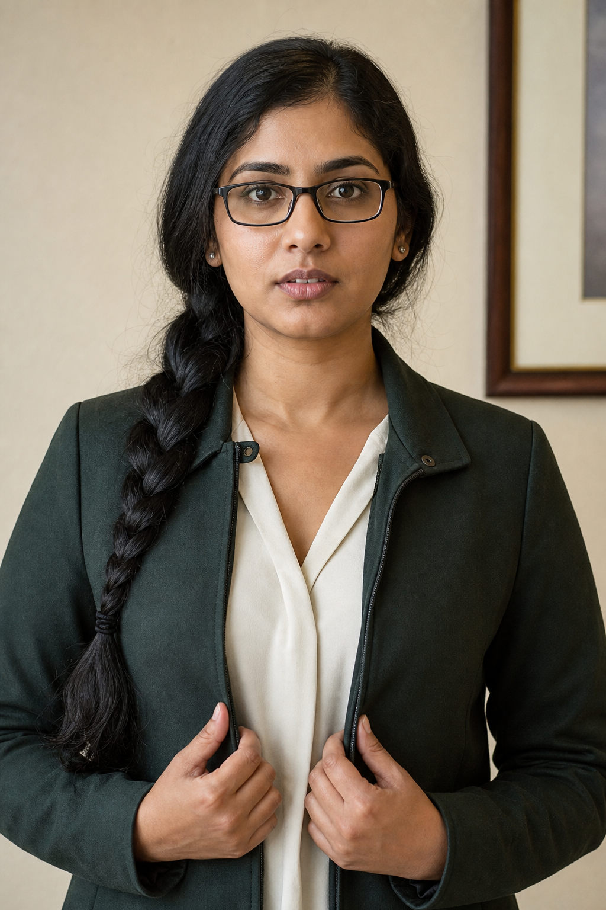
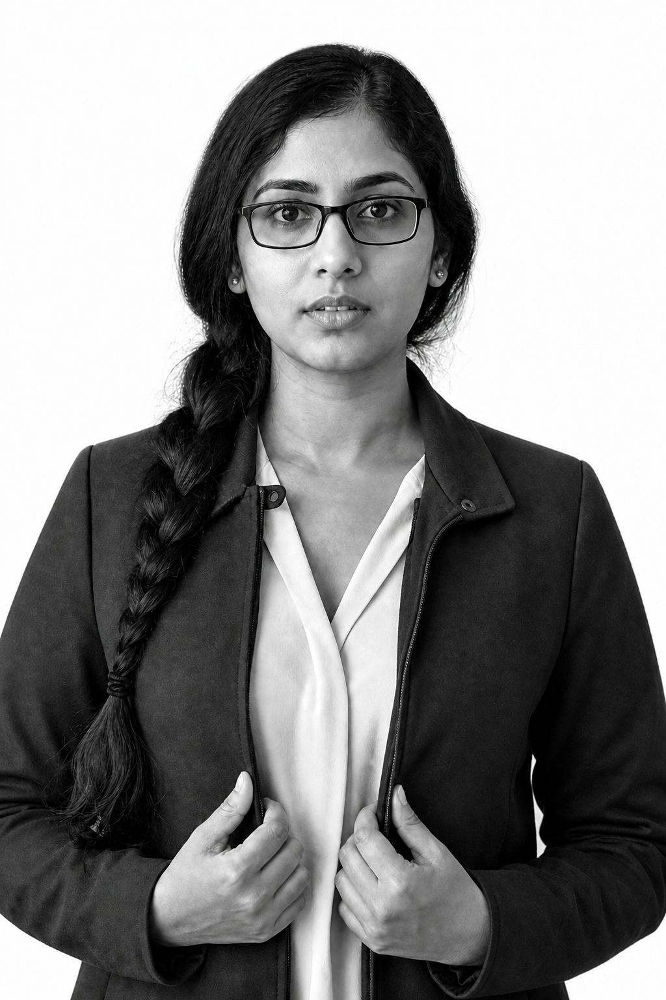
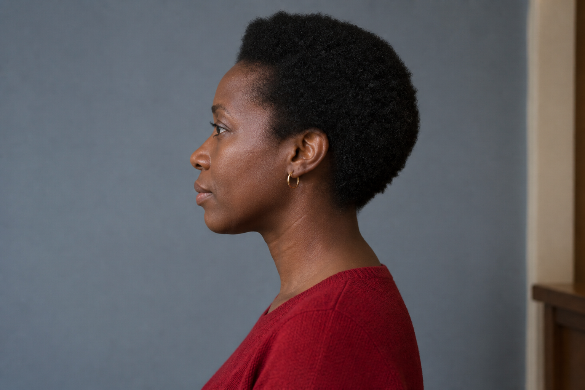
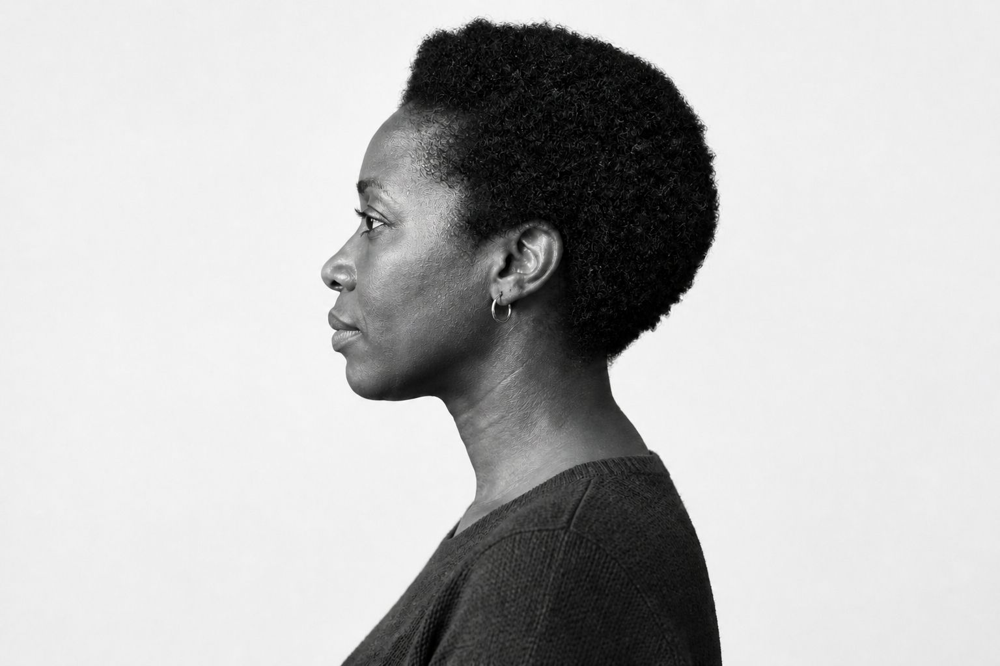
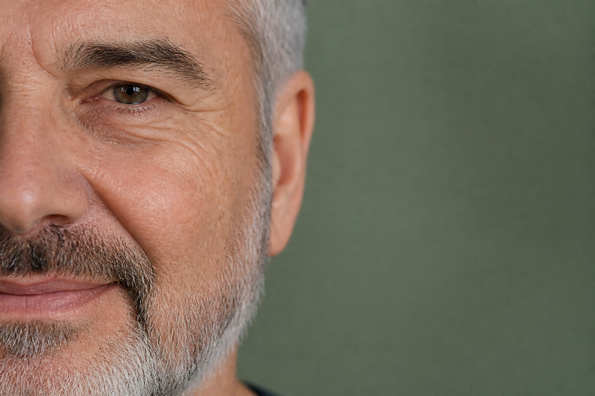
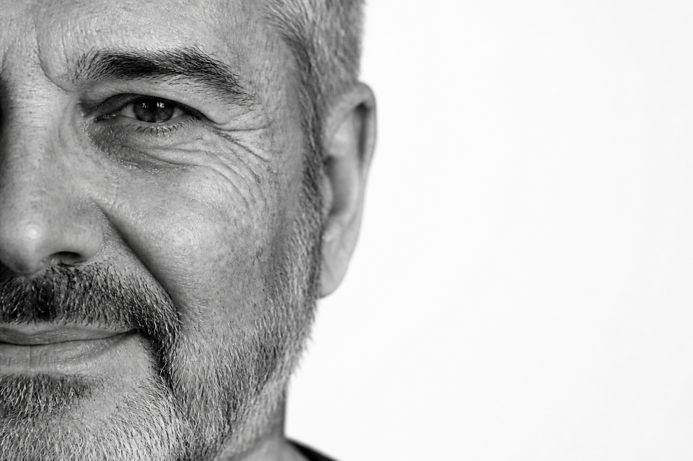

<p align="center">
  
  &nbsp;
  
</p>
<p align="center"><sub>左：输入　右：精确路线结果。合成验收图，不是 Avedon 原作，也不是真实用户。</sub></p>

# Avedon Portrait Skill

把一张单人照片改成 Avedon 式正式肖像。能对上证据就按路线做；对不上就只改背景和影调，不把侧脸补成正脸。

**[安装](#快速开始)** · [查看验收图](evals/visual/visual-results.md)

**状态：** Corpus V1 可用。还没有打 GitHub Release。

Avedon Portrait Skill 是一个面向 ChatGPT、Codex 和兼容 [Agent Skills](https://agentskills.io/) 环境的人像 Skill。当你有一张单人照片、想做成白底黑白正式肖像时，它先看这张图的结构，再选一条删身份信息最少的做法。

## 演示

侧脸要还是侧脸，缺的那一块要还是缺。

<table>
  <tr>
    <td align="center" width="50%"><br/><sub>输入：侧脸</sub></td>
    <td align="center" width="50%"><br/><sub>结果：没有转成正脸</sub></td>
  </tr>
  <tr>
    <td align="center" width="50%"><br/><sub>输入：半张脸</sub></td>
    <td align="center" width="50%"><br/><sub>结果：没有把脸补全</sub></td>
  </tr>
</table>

全身输入会往里裁到大腿附近，不裁成腰部以上只为了贴上 supported 标签。六组对照和评分见 [`evals/visual/visual-results.md`](evals/visual/visual-results.md)。

## 为什么做这个项目

把照片丢进「做成 Avedon 风格」的提示词，模型常会把侧脸拓成正脸、把半张脸补全，或另外生成一个长得像的人。画面像样，人已经换了。

这个项目只解决一件事：在不补看不见的脸的前提下，把单人照片做成有作品依据的正式肖像。

## 核心能力

- **按结构选做法** — 先看景别、朝向、脸是否完整。对得上证据就走精确路线；安全裁切后恰好对上，才用 crop fallback；否则只改背景和影调。
- **看得见的留下** — 朝向、脸的完整程度、五官、表情类别、衣服和本人的手势都保留。输入里没有的脸不造。
- **证据和生成分开** — 规则来自实际看过的标注。仓库不存 Avedon 照片，只存来源网址、观察记录和由此写出的规则。
- **不拿职业套风格** — 默认走一般正式肖像。只有你明确要求，或给了 In the American West 参考，才走那一组。

## 快速开始

仓库根目录就是可安装的 Skill。`SKILL.md` 里的 `name` 是 `avedon-portrait`。

### 复制到 Skills 目录

```bash
git clone https://github.com/Lucian1u/avedon-portrait-skill.git avedon-portrait
```

把得到的 `avedon-portrait` 目录放到所用工具的 skills 目录。Codex 一般是 `~/.codex/skills/`。

### Codex 安装脚本

```bash
python3 ~/.codex/skills/.system/skill-installer/scripts/install-skill-from-github.py \
  --repo Lucian1u/avedon-portrait-skill \
  --path . \
  --name avedon-portrait
```

然后：

1. 重新打开宿主，确认能选到 `avedon-portrait`
2. 附上一张只有一个人的照片
3. 用下面的提示词跑一次：应得到白底黑白肖像；侧脸仍是侧脸

## 使用示例

### 一般正式肖像

```text
用 avedon-portrait 处理这张单人照片。
```

预期结果：白底、黑白、正式肖像。腰部以上正面走精确路线；全身往里裁到大腿附近，不裁成腰部以上只为了贴标签。

### 侧脸或半张脸

```text
用 avedon-portrait 处理这张照片。不要把脸转正，也不要补全。
```

预期结果：侧脸还是侧脸，缺的那一块还是缺。背景和影调可以改。

### 明确要求 In the American West

```text
用 avedon-portrait，按 In the American West 处理这张照片。衣服不要改。
```

预期结果：走 IAW 路线的摄影处理，不换工装、牛仔或年代道具。

## 工作原理

```text
单人照片
  ↓
识别景别、朝向、脸是否完整
  ↓
精确路线 / 安全往里裁 / 只改背景和影调
  ↓
用原图做图像编辑
  ↓
正式肖像
```

精确路线现在有三条：一般正式肖像的腰部以上正面；IAW 的腰部以上正面；IAW 的三分之四身、腿部裁切。依据在 [`references/supported-routes.md`](references/supported-routes.md)，统计在 [`research/corpus-findings.md`](research/corpus-findings.md)。

运行时必须把用户照片交给图像编辑工具。不能改成纯文字生成一张「长得像的人」。

`research/`、`evals/` 和 `scripts/` 只用于审计、测试和后续改规则，不会自动进普通生成上下文。

## 边界与限制

这个项目不会：

- 处理双人、群像、时装片、报道摄影、街拍或环境肖像
- 把侧脸、背影、半张脸补成正脸
- 为了贴上 supported 标签而多裁一刀
- 根据外貌或职业自动改走 In the American West
- 在仓库里提供 Avedon 原作

六条视觉回归证明的是：这套规则能让当前用到的编辑器做出上面写的行为。它们不能证明换一套编辑后端、或换真实用户、低分辨率、遮挡脸之后仍然同样稳。

## 隐私与安全

- 本仓库不接收、不转发、不保存你的照片
- 照片只进入你使用的宿主
- 仓库里的验收图是合成的成人形象，用来测行为，不是真实用户

如需报告安全问题，请查看 [`SECURITY.md`](SECURITY.md)。

## 兼容性

| 环境 | 状态 | 说明 |
|---|---|---|
| Codex | 已用当前图像编辑流程跑通 6 条合成源图 | 安装后仍需要宿主支持参考图编辑 |
| ChatGPT（Agent Skills） | 未单独验收 | 带 `agents/openai.yaml`；效果取决于宿主能否把原图交给编辑工具 |
| 其他兼容 Agent Skills 的工具 | 未验证 | 入口是仓库根目录的 `SKILL.md` |

没有实际验证的环境写成「未验证」，不写成「支持」。

## 仓库结构

```text
avedon-portrait-skill/
├── SKILL.md                 # 运行入口
├── agents/openai.yaml       # 界面与默认调用信息
├── references/              # 生成时按需读取的规则
├── research/                # corpus、schema、来源与研究记录
├── evals/                   # 行为用例、合成源图和视觉验收
├── scripts/                 # corpus 分析与校验
├── README.md
├── CHANGELOG.md
├── CONTRIBUTING.md
├── SECURITY.md
└── LICENSE
```

## 开发与验收

```bash
python3 scripts/validate_research.py
```

当前已经核验：

- 权威候选 216 条；看图并完成 55 字段标注 85 条；可进路线统计 70 条
- 已支持的精确路线 3 条
- `python3 scripts/validate_research.py` 通过
- 6 条合成源图视觉回归最终全部通过；其中 1 条错误裁切按规则从原图重做后通过

这不表示已经在 ChatGPT 网页端做完独立验收，也不表示换一个图像模型会得到同一张结果。

## 项目状态

- 当前版本：Corpus V1
- 已完成：单人正式肖像规则、3 条精确路线、回退策略、研究记录和 6 条视觉回归
- 尚未完成：GitHub Release；正面紧头部等 provisional 结构还不能当精确路线
- 版本记录：[`CHANGELOG.md`](CHANGELOG.md)

## 参与项目

提交问题或改动前，请阅读 [`CONTRIBUTING.md`](CONTRIBUTING.md)。

## License

MIT — 见 [`LICENSE`](LICENSE)。
